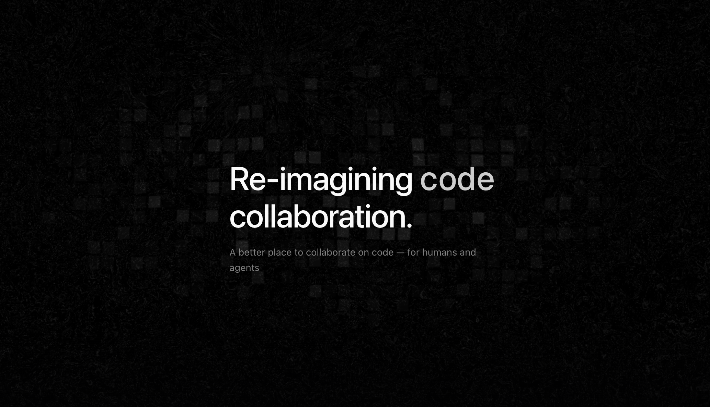

# Repolith

Re-imagining code collaboration — a better place to collaborate on code, for humans and agents.

## Why

At Kalt Labs, we spend a lot of our time on GitHub. So we decided to build the experience we actually wanted. Repolith improves everything from the home page to repo overview, PR reviews, and AI integration — faster and more pleasant overall.

## Features

- **Repo overview** — cleaner layout with README rendering, file tree, activity feed
- **PR reviews** — inline diffs, AI-powered summaries, review comments
- **Issue management** — triage, filter, and act on issues faster
- **Ghost (AI assistant)** — review PRs, navigate code, triage issues, write commit messages (`⌘I` to toggle)
- **Command center** — search repos, switch themes, navigate anywhere (`⌘K`)x
- **CI/CD status** — view workflow runs and compare across branches
- **Security advisories** — track vulnerabilities per repo
- **Keyboard-first** — most actions accessible via shortcuts
- **Browser extension** — adds a "Open in Repolith" button on GitHub pages (Chrome & Firefox supported)

## Contributing

See [CONTRIBUTING.md](CONTRIBUTING.md) for development setup, PR workflow, and code style guidelines.

## License

[MIT](LICENSE)
